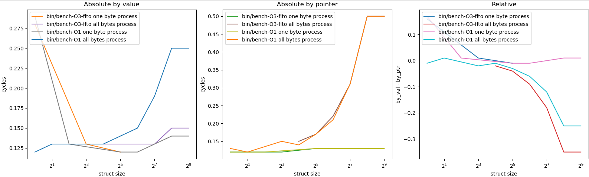

# By value or by pointer?
This benchmark will show time of processing functions with arguments passed by value or pointer.

### Run
```sh
./build.py run
```
require
```
pip install matplotlib
```

## Results
Example:



Y-axis unit = `time_t` cycles
X-axis unit = sizeof(struct)  which is argument passed by value or by pointer

The relative plot is showing "time by value - time by pointer" or "how much pointer faster than value copy"

Each time value is average time for 100000 times of measurements.

"one byte process" - is functions where only one byte changes

"all bytes process" - is functions where all bytes changes
it shows difference time processing of dereference of each address